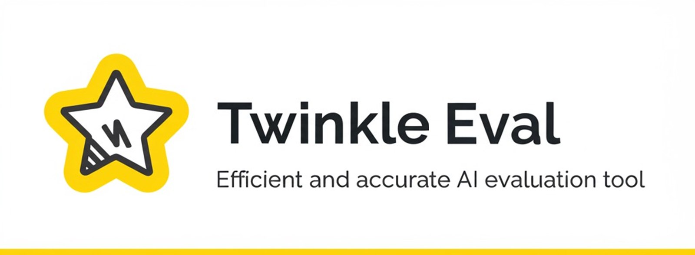
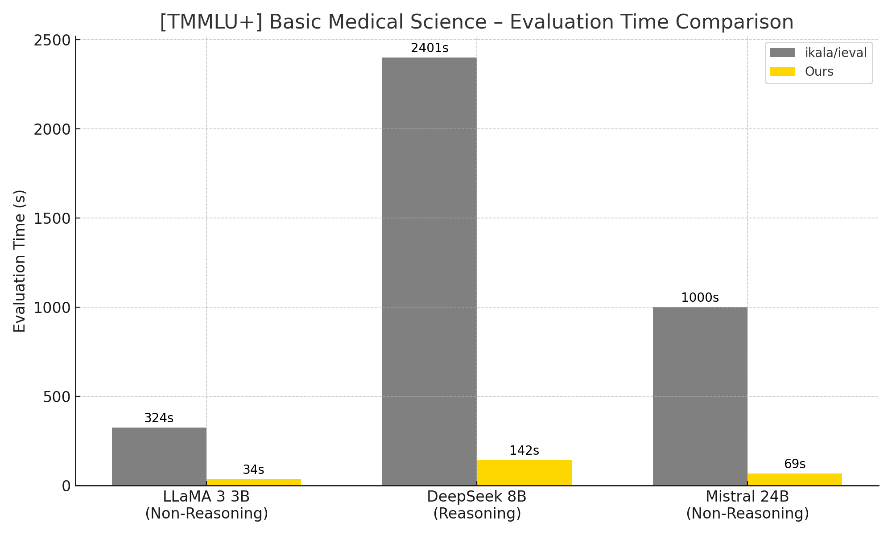

# 🌟 Twinkle Eval：高效且準確的 AI 評測工具

[](https://www.python.org)


[](https://github.com/ai-twinkle/Eval/pulls)


[](https://discord.gg/Cx737yw4ed)
[](https://huggingface.co/twinkle-ai)
[](https://linkedin.com/company/twinkle-ai)

[](https://colab.research.google.com/github/LiuYuWei/llm-colab-application/blob/main/Simon_LLM_Application_Twinkle_Eval_Tool_Google_Gemini_Model_Evaluation.ipynb)

本專案為 LLM（Large Language Model）評測框架，採用並行且隨機化測試方法，提供客觀的模型性能分析與穩定性評估，並支援多種常見評測數據集。
> 📖 **[Twinkle Eval 可對話式維基百科頁面（由 DeepWiki 生成）](https://deepwiki.com/ai-twinkle/Eval)**  
> 備註：內容由人工智慧生成，準確性無法保證，僅供參考。

## 目錄

- [功能特色](#功能特色)
- [性能指標](#性能指標)
- [技術特點](#技術特點)
  - [評測方法](#評測方法)
  - [支援格式及常見數據集](#支援格式及常見數據集)
  - [API 效能設定](#api-效能設定)
- [安裝設定](#安裝設定)
- [使用方式](#使用方式)
- [設定檔說明](#設定檔說明)
  - [LLM API 設定](#llm-api-設定)
  - [模型設定](#模型設定)
  - [評測設定](#評測設定)
  - [日誌設定](#日誌設定)
- [輸出結果](#輸出結果)
- [模型實測結果](#模型實測結果)
- [貢獻者](#貢獻者)
- [授權條款](#授權條款)
- [引用](#引用)
- [致謝](#致謝)

## 功能特色

- **自動化評測多個檔案**：可批次處理並統一生成評測結果。
- **可自訂評測參數與生成控制**：可設定溫度、top_p 等生成參數。
- **選項隨機排列功能**：避免模型因選項順序產生偏好。
- **Pattern 或 Box 雙模式評測**：支援文字匹配或框選評分邏輯。
- **多次測試平均分析**：設定測試回合數以觀察模型表現穩定性。
- **計算平均正確率與穩定性指標**：量化模型答題準確度與波動程度。
- **紀錄 LLM 推論與統計結果**：用於後續分析模型在各類題型的表現。
- **支援 OpenAI API 格式**：相容於常見的 GPT API 輸入與輸出格式。
- **安全地處理 API 金鑰**：避免金鑰暴露於程式碼或日誌中。
- **API 請求限流控制與自動重試機制**：減少錯誤發生並提高 API 請求成功率。

## 性能指標

下圖展示了在 [ikala/tmmluplus](https://huggingface.co/datasets/ikala/tmmluplus) - **basic_medical_science**（共 954 題）子任務上，Twinkle Eval 與現有工具 [iKala/ievals](https://github.com/iKala/ievals) 在三種模型下的推論時間比較：



- [meta-llama/Llama-3.2-3B-Instruct](https://huggingface.co/meta-llama/Llama-3.2-3B-Instruct) (非推理任務)：Twinkle Eval 快了 **9.4 倍**。
- [deepseek-ai/DeepSeek-R1-Distill-Llama-8B](https://huggingface.co/deepseek-ai/DeepSeek-R1-Distill-Llama-8B) (推理任務)：Twinkle Eval 快了 **16.9 倍**。
- [mistralai/Mistral-Small-24B-Instruct-2501](https://huggingface.co/mistralai/Mistral-Small-24B-Instruct-2501) (非推理任務)：Twinkle Eval 快了 **14.5 倍**。

這項實驗結果顯示，**Twinkle Eval 在不同模型大小與任務類型下皆能顯著提升效能，最高達近 17 倍速度優勢**，同時保持準確率一致。這對於需要大量評測的 LLM 開發工作流程，能大幅縮短週期、節省成本。

## 技術特點

### 評測方法

- **隨機化測試**：參考 [Changing Answer Order Can Decrease MMLU Accuracy](https://arxiv.org/html/2406.19470v1)，實作**選項隨機排列功能**，更能客觀的評估模型能力。
- **穩定性分析**：支援多次測試並進行統計分析。
- **格式控制**：指定 `\box{選項}` 或 `\boxed{選項}` 等框選格式，嚴格管理輸出呈現樣式。
- **錯誤處理**：自動重試與超時控制機制。

### 支援格式及常見數據集

任何符合以下格式的 `.csv`、`.json`、`.jsonl` 或 `.parquet` 檔案，內容需包含下列欄位格式（不限於 TMMLU+）：

```csv
  question,A,B,C,D,answer
```

以下列出已知評測集：

- [TMMLU+](https://huggingface.co/datasets/ikala/tmmluplus)
- [MMLU](https://github.com/hendrycks/test)
- [tw-legal-benchmark-v1](https://huggingface.co/datasets/lianghsun/tw-legal-benchmark-v1)
- [Formosa-bench](https://huggingface.co/datasets/lianghsun/Formosa-bench)

### API 效能設定

- 設定請求限流：無限制或指定 QPS（Queries Per Second）數值。
- 超時設定。
- 可選是否進行 SSL 驗證。
- 錯誤恢復機制。

## 安裝設定

### 方法一：使用 pip 安裝（推薦）

```bash
# 從 PyPI 安裝（穩定版本）
pip install twinkle-eval

# 或從 GitHub 安裝（最新版本）
pip install git+https://github.com/ai-twinkle/Eval.git
```

### 方法二：從原始碼安裝

1. 複製專案至本機
   ```bash
   git clone https://github.com/ai-twinkle/Eval.git
   cd Eval
   ```

2. 安裝套件
   ```bash
   # 安裝正式版本
   pip install .
   
   # 或安裝開發版本（包含開發工具）
   pip install -e ".[dev]"
   ```

## 使用方式

### 快速開始

1. 安裝完成後，創建配置檔案：
   ```bash
   # 使用內建命令創建預設配置檔案
   twinkle-eval --init
   
   # 編輯配置檔案
   nano config.yaml
   ```

2. 準備評測資料集：
   ```bash
   mkdir datasets
   # 將您的資料集檔案放入 datasets 目錄
   ```

3. 執行評測：
   ```bash
   twinkle-eval --config config.yaml
   ```

### 命令列選項

安裝完成後，您可以使用 `twinkle-eval` 命令：

```bash
# 創建預設配置檔案
twinkle-eval --init

# 使用預設配置執行評測
twinkle-eval

# 使用自定義配置檔案
twinkle-eval --config path/to/your/config.yaml

# 同時輸出多種格式的結果
twinkle-eval --export json csv html

# 列出支援的 LLM 類型
twinkle-eval --list-llms

# 列出支援的評測策略
twinkle-eval --list-strategies

# 列出支援的輸出格式
twinkle-eval --list-exporters

# 顯示版本資訊
twinkle-eval --version

# 顯示完整幫助
twinkle-eval --help
```

### Python API 使用

您也可以在 Python 程式中直接使用 Twinkle Eval：

```python
from twinkle_eval import TwinkleEvalRunner

# 建立評測執行器
runner = TwinkleEvalRunner("config.yaml")

# 初始化
runner.initialize()

# 執行評測
results = runner.run_evaluation(export_formats=["json", "csv"])

print(f"評測完成！結果已儲存至：{results}")
```

評測結果會儲存在 `results` 目錄中，檔名包含時間戳記。

## 程式碼架構

重構後的程式碼採用模組化設計，主要包含以下模組：

- **`config.py`**: 配置管理，負責載入和驗證配置檔案
- **`main.py`**: 主程式入口點，處理命令列介面和評測流程控制
- **`models.py`**: LLM 抽象層，支援多種 LLM API（目前支援 OpenAI 相容格式）
- **`datasets.py`**: 資料集載入和處理，支援 JSON、JSONL、CSV、TSV、Parquet 格式
- **`evaluators.py`**: 評測核心邏輯，包含並行處理和進度追蹤
- **`evaluation_strategies.py`**: 答案提取策略，包含 Pattern、Box、自定義正則三種策略
- **`results_exporters.py`**: 結果輸出模組，支援 JSON、CSV、HTML 等格式
- **`validators.py`**: 驗證工具，確保配置和資料集的正確性
- **`exceptions.py`**: 自定義異常類別，提供精確的錯誤處理

這種模組化設計讓程式碼更容易維護和擴展，開發者可以輕鬆：
- 新增支援新的 LLM API
- 實現新的答案提取策略
- 增加新的輸出格式
- 改進驗證邏輯

## 設定檔說明

設定檔使用 YAML 格式，包含以下主要區段：

### LLM API 設定

```yaml
llm_api:
  base_url: "http://your-openai-compatible-server/v1" # API 伺服器網址
  api_key: "your-api-key" # API 金鑰
  disable_ssl_verify: false # 是否停用 SSL 驗證
  api_rate_limit: 2 # 每秒請求限制（-1 為不限制）
  max_retries: 5 # API 呼叫失敗時的重試次數
  timeout: 600 # API 呼叫的超時時間 (秒)
```

### 模型設定

```yaml
model:
  name: "model-name" # 模型名稱
  temperature: 0.0 # 溫度參數
  top_p: 0.9 # Top-p 機率閾值
  max_tokens: 4096 # 最大輸出 token 數
  frequency_penalty: 0.0 # 頻率懲罰
  presence_penalty: 0.0 # 存在懲罰
```

### 評測設定

```yaml
evaluation:
  dataset_paths: # 資料集路徑
    - "datasets/dataset1/"
    - "datasets/dataset2/"
  evaluation_method: "box" # 評測方法（支援 "pattern" 或 "box"）
  system_prompt:        # 系統提示詞，僅於 box 評測方法中使用
    zh: |
      使用者將提供一個題目，並附上選項 A、B、C、D
      請仔細閱讀題目要求，根據題意選出最符合的選項，並將選項以以下格式輸出：
      \box{選項}
      請確保僅將選項包含在 { } 中，否則將不計算為有效答案。
      務必精確遵循輸出格式，避免任何多餘內容或錯誤格式。
    en: |
      The user will provide a question along with options A, B, C, and D.
      Please read the question carefully and select the option that best fits the requirements.
      Output the selected option in the following format:
      \box{Option}
      Make sure to include only the option within the curly braces; otherwise, it will not be considered a valid answer.
      Strictly follow the output format and avoid any extra content or incorrect formatting.
  datasets_prompt_map:
    "datasets/mmlu/": "en" # 指定資料集使用英文提示詞
  repeat_runs: 5 # 單一 datasets 重複執行次數
  shuffle_options: true # 是否對選項進行隨機排序
```

### 日誌設定

```yaml
logging:
  level: "INFO" # 日誌等級（可選 DEBUG, INFO, WARNING, ERROR）
```

## 輸出結果

本專案輸出兩份結果，分別為 `results_{timestamp}.json` 與 `eval_results_{timestamp}.json`。

### `results_{timestamp}.json`

這個檔案主要用來**統整整份評測的摘要資訊**，適合：

- 快速查看模型在多份資料集上的表現
- 對比不同模型、設定的平均準確率
- 對照使用的模型參數、API 設定
- 可搭配 timestamp 作為評測版本控制紀錄依據

```json
{
  "timestamp": "20250314_1158", // 評測執行的時間戳記
  "results": [
    // 各個測試檔案的評測結果
    {
      "file": "datasets/test/basic_medical_science_train.csv", // 測試檔案路徑
      "accuracy": 0.4 // 模型在該檔案上的正確率
    },
    {
      "file": "datasets/test/culinary_skills_dev.csv",
      "accuracy": 0.4
    }
  ],
  "average_accuracy": 0.4, // 所有資料集的平均正確率
  "config": {
    "llm_api": {
      "base_url": "http://localhost:8002/v1/", // 呼叫模型的 API 端點
      "api_key": "EMPTY" // API 金鑰（此處為空）
    },
    "model": {
      "name": "checkpoint-108", // 使用的模型名稱
      "temperature": 0, // 溫度參數（影響隨機性）
      "top_p": 0.9, // Top-p 採樣參數
      "max_tokens": 4096, // 最大生成長度
      "frequency_penalty": 0,
      "presence_penalty": 0
    },
    "evaluation": {
      "dataset_path": "datasets/test/", // 評測資料集目錄
      "api_concurrency": 40, // 並行請求數（影響推論速度）
      "evaluation_method": "box", // 評測方式為 box 模式
      "system_prompt": { // 系統提示詞
        "zh": "...", // 中文提示詞
        "en": "..."  // 英文提示詞
      },
      "datasets_prompt_map": {
        "datasets/mmlu/": "en"
      }
    }
  },
  "logging": {
    "level": "INFO" // 日誌等級
  }
}
```

### `eval_results_{timestamp}.json`

這個檔案用來**記錄單一測試檔中每一題的答題狀況**，適合：

- 分析錯題、了解模型出錯的傾向
- 搭配資料視覺化（如 confusion matrix、錯誤率熱圖）

```json
{
  "timestamp": "20250314_1158",  // 評測執行的時間戳記
  "file": "datasets/test/basic_medical_science_train.csv",  // 測試檔案路徑
  "accuracy": 0.4,  // 模型在該檔案上的整體正確率

  "details": [  // 每題的評測詳情
    {
      "question_id": 0,  // 題目編號
      "question": "下列何者僅位於腎臟皮質（cortex）？A: 乳頭管 ...",  // 題目內容與選項
      "correct_answer": "C",  // 正確答案
      "predicted_answer": "C",  // 模型預測答案
      "is_correct": true  // 預測是否正確
    },
    {
      "question_id": 1,
      ...
    }
  ]
}
```

## 模型實測結果

> [!NOTE]
> 本表將隨時間更新模型評測分數

| 模型                                                                                                                          | 評測模式 | TMMLU+(%)       | tw-legal(%)     | MMLU(%)         | 測試次數 | 選項排序 |
| ----------------------------------------------------------------------------------------------------------------------------- | -------- | --------------- | --------------- | --------------- | -------- | -------- |
| [meta-llama/Llama-4-Maverick-17B-128E-Instruct-FP8](https://huggingface.co/meta-llama/Llama-4-Maverick-17B-128E-Instruct-FP8) | box      | 78.27 (±0.0130) | 61.40 (±0.0081) | 87.26 (±0.0085) | 3        | 隨機     |
| [meta-llama/Llama-4-Scout-17B-16E-Instruct](https://huggingface.co/meta-llama/Llama-4-Scout-17B-16E-Instruct)                 | box      | 67.71 (±0.0147) | 47.21 (±0.0045) | 83.31 (±0.0097) | 3        | 隨機     |
| [mistralai/Mistral-Small-24B-Instruct-2501](https://huggingface.co/mistralai/Mistral-Small-24B-Instruct-2501)                 | box      | 56.15 (±0.0172) | 37.48 (±0.0098) | 74.61 (±0.0154) | 3        | 隨機     |
| [meta-llama/Llama-3.2-3B-Instruct](https://huggingface.co/meta-llama/Llama-3.2-3B-Instruct)                                   | box      | 15.49 (±0.0104) | 25.68 (±0.0200) | 6.90 (±0.0096)  | 3        | 隨機     |
| [meta-llama/Llama-3.2-3B-Instruct](https://huggingface.co/meta-llama/Llama-3.2-3B-Instruct)                                   | pattern  | 35.85 (±0.0174) | 32.22 (±0.0023) | 59.33 (±0.0168) | 3        | 隨機     |
| [MediaTek-Research/Llama-Breeze2-3B-Instruct](https://huggingface.co/MediaTek-Research/Llama-Breeze2-3B-Instruct)             | pattern  | 40.32 (±0.0181) | 38.92 (±0.0193) | 55.37 (±0.0180) | 3        | 隨機     |
| [twinkle-ai/Llama-3.2-3B-F1-Instruct](https://huggingface.co/twinkle-ai/Llama-3.2-3B-F1-Instruct)                             | box      | 46.16 (±0.0198) | 34.92 (±0.0243) | 51.22 (±0.0206) | 3        | 隨機     |

## 貢獻者

[](https://github.com/teds-lin)
[](https://github.com/lianghsun)
[](https://github.com/cyc00518)
[](https://github.com/k1dav)

本專案由 [Twinkle AI](https://github.com/ai-twinkle) 與 [APMIC](https://www.apmic.ai/) 合作開發。

## 授權條款

本儲存庫的原始碼依照 [MIT](https://github.com/ai-twinkle/Eval?tab=MIT-1-ov-file#readme) 授權條款開源。

## 引用

如果您覺得此評測工具有幫助到，請再不吝引用如下：

```bibtex
@misc{twinkle_eval,
  author       = {Teds Lin, Liang Hsun Huang, Min Yi Chen and Dave Sung},
  title        = {Twinkle Eval: An Efficient and Accurate AI Evaluation Tool.},
  year         = {2025},
  url          = {https://github.com/ai-twinkle/Eval},
  note         = {GitHub repository}
}
```

## 致謝

在本專案的開發過程中，我們參考了 [iKala/ievals](https://github.com/iKala/ievals) 專案中的模式設計理念，該專案對我們的設計方向提供了寶貴的啟發，特此致上誠摯感謝。
同時也感謝 [Simon Liu](https://simonliuyuwei-4ndgcf4.gamma.site/) 提供的 Colab [示範範例](https://colab.research.google.com/github/LiuYuWei/llm-colab-application/blob/main/Simon_LLM_Application_Twinkle_Eval_Tool_Google_Gemini_Model_Evaluation.ipynb)，協助我們更直觀地呈現工具的使用方式與實際應用場景。
